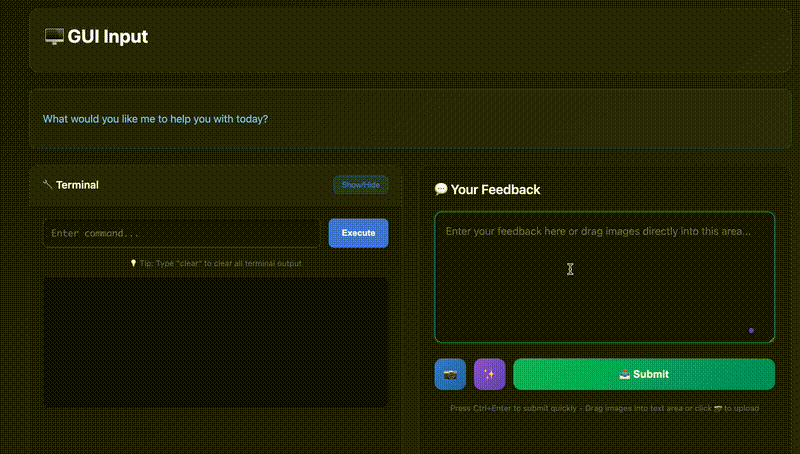
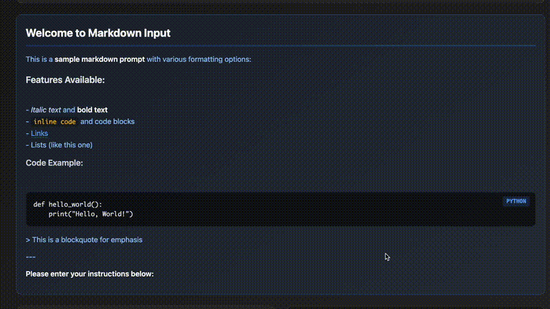
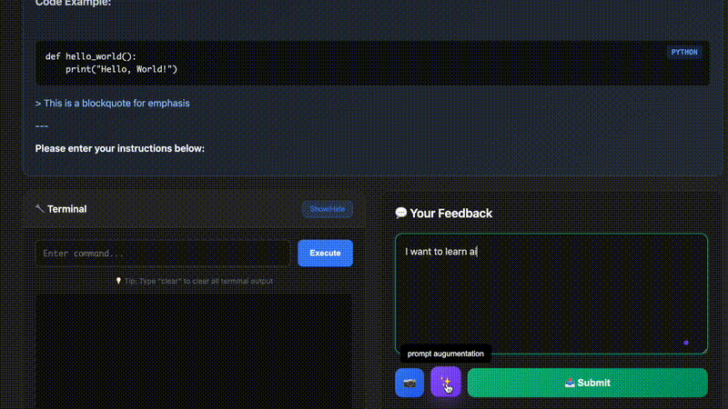
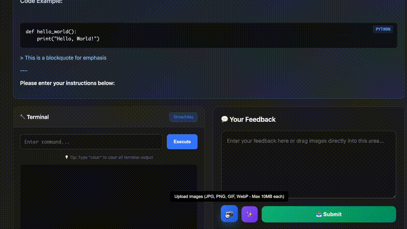

# MCP GUI Server

[English](README.md) ｜ [简体中文](README_zh.md)

一个现代化的 Model Context Protocol (MCP) 服务器，提供优雅的图形用户界面交互、交互式反馈风格、终端支持，以及先进的提示工程功能。


## 预览


_MCP 帮助降低频繁调用 AI 服务的成本_

## 🚀 快速开始

### 方案 1：NPX（测试推荐）

无需安装即可立刻体验服务器：

```bash
npx mcp-gui-server
```

### 方案 2：源码安装

适用于开发或自定义：

```bash
# 克隆仓库
git clone https://github.com/oqwn/mcp-gui-server.git
cd mcp-gui-server

# 安装依赖
pnpm install

# 构建项目
pnpm run build

# 启动服务器
pnpm start
```

### 前置条件

- Node.js 18+
- pnpm 8+（推荐的包管理器）

若尚未安装 pnpm：

```bash
npm install -g pnpm
```

## 💼 MCP 客户端集成

### 步骤 1：配置你的 MCP 客户端

向你的 MCP 客户端（Claude Desktop、Cursor、Windsurf 等）添加以下配置。仅当你希望使用 AI 模型来增强提示时才需要添加 `OPENROUTER_MODEL` 等环境变量：

#### 使用 NPX（推荐）

```json
{
  "mcpServers": {
    "mcp-gui-server": {
      "command": "npx",
      "args": ["-y", "mcp-gui-server"],
      "env": {
        "OPENROUTER_API_KEY": "YOUR API KEY",
        "OPENROUTER_BASE_URL": "https://openrouter.ai/api/v1",
        "OPENROUTER_MODEL": "MODEL YOUR SELECTED"
      }
    }
  }
}
```

#### 使用本地安装

在使用以下 MCP 配置前，你需要先克隆本仓库并执行构建：

```bash
pnpm run build
```

```json
{
  "mcpServers": {
    "gui-server": {
      "command": "node",
      "args": ["/path/to/dist/server.js", "--stdio"],
      "env": {
        "OPENROUTER_API_KEY": "YOUR API KEY",
        "OPENROUTER_BASE_URL": "https://openrouter.ai/api/v1",
        "OPENROUTER_MODEL": "MODEL YOU SELECTED"
      }
    }
  }
}
```

### 步骤 2：重启 MCP 客户端

完成配置后，重启你的 MCP 客户端以加载服务器。

### 步骤 3：测试集成

在你的 AI 助手中，现在应当能看到 `gui-input` 工具。尝试输入：

> “请通过 GUI 收集一些用户输入”

---

## 🛠️ 开发与测试

### HTTP 模式（开发）

用于本地开发与调试：

```bash
pnpm run dev
```

服务器将以热重载方式启动在 `http://localhost:3501`。

---

## ✨ 功能特性

### 🎯 核心能力

- **🖥️ 交互式 GUI**：美观、现代的网页界面用于用户输入
- **📷 图片上传**：拖拽或点击上传图片（JPG、PNG、GIF、WebP，单文件最大 10 MB）
- **💻 终端集成**：持久 Shell 会话中执行命令
- **🔄 实时反馈**：与用户协作的交互式工作流
- **🛡️ 会话管理**：安全、自动过期的会话及清理机制
- **📱 响应式设计**：兼容桌面和移动端
- **🎨 语法高亮**：专业级代码块渲染


_持久 Shell 会话与命令执行_

### 🚀 高级功能

- **🧠 提示工程**：内置 AI 驱动的提示增强
- **🔌 13+ LLM 提供商**：OpenAI、Anthropic、Groq、Ollama 等
- **🌍 多语言支持**：保持语言一致性
- **⚡ 热重载**：无需重启即可编辑提示
- **📊 错误处理**：健壮的回退与日志记录


_AI 驱动的提示增强，支持多家 LLM 提供商_

### 📷 图片上传特性

- **🎯 直观界面**：上传按钮与增强、提交按钮集成
- **🖱️ 拖拽上传**：可直接将图片拖入文本区域
- **📁 多格式支持**：兼容 JPG、JPEG、PNG、GIF、WebP
- **📏 大小校验**：单张图片最大 10 MB，并实时验证
- **🖼️ 预览网格**：缩略图预览，附带文件信息与删除功能
- **🤖 AI 兼容**：上传图片以 Base64 格式嵌入 MCP 请求，便于多模态 AI 分析
- **🔒 安全处理**：图片编码后安全传输


_拖拽上传、预览与校验_

### 🎛️ 最佳 AI 助手集成规则

为获得最佳效果，在 AI 助手配置中加入以下规则：

```
1. 当你需要向用户提问时，始终调用 MCP gui-input。

2. 当你准备完成用户请求时，使用 MCP gui-input，而不是直接结束流程。

3. 持续调用 MCP，直到用户反馈为空，然后结束请求。
```

_示例位置：Cursor 规则、Claude Desktop 自定义指令等。_

---

## 🏗️ 项目架构

本项目采用现代化模块化架构，关注点清晰分离：

```
mcp-gui-server/
├── src/
│   ├── server.ts                 # 主 MCP 服务器实现
│   ├── gui-service.ts            # GUI 服务协调器
│   ├── handlers/                # HTTP 请求处理器
│   │   ├── base-handler.ts      # 基类处理器
│   │   ├── gui-handler.ts       # GUI 接口处理
│   │   ├── command-handler.ts   # 终端命令执行
│   │   └── submit-handler.ts    # 表单提交 & LLM 集成
│   ├── services/                # 核心业务逻辑
│   │   ├── session-service.ts   # 会话管理与清理
│   │   ├── llm-service.ts       # 多提供商 LLM 集成
│   │   └── terminal-service.ts  # Shell 命令执行
│   ├── templates/               # HTML 模板生成
│   │   └── gui-template.ts      # 专业 UI 模板
│   ├── utils/                   # 工具函数
│   │   ├── markdown.ts          # Markdown → HTML 增强
│   │   └── network.ts           # 端口管理工具
│   └── types/                   # TypeScript 类型定义
│       └── interfaces.ts        # 共享接口定义
├── images/                      # 演示 GIF 与文档资源
│   ├── terminal.gif             # 终端功能演示
│   ├── enhance.gif              # 提示增强演示
│   └── upload.gif               # 图片上传演示
├── prompts/                     # 外部提示管理
│   ├── system-prompt.md         # 主提示增强脚本
├── package.json
├── tsconfig.json
└── README.md
```

### 📋 架构优势

- **🔧 可维护性**：模块单一职责，易于维护
- **🧪 可测试性**：组件可独立测试
- **♻️ 可复用性**：服务可在不同处理器间复用
- **📈 可扩展性**：轻松新增功能，互不影响
- **📚 文档完备**：结构清晰，文档详尽

---

## 🐛 故障排查

### 端口被占用

如果默认端口（3501）已被占用，服务器会自动寻找可用端口：

```
⚠️ Port 3501 is in use, searching for available port...
✅ Found available port: 3517
```

### 会话过期

若看到 “Session Invalid or Expired” 提示：

1. 不要直接在浏览器访问 GUI URL
2. 在 MCP 客户端中使用 `gui-input` 工具
3. 检查是否超过 5 分钟会话超时时间

### 终端命令无响应

确保 Shell 进程已正确初始化：

- 命令在持久 Shell 中保持状态
- 使用标准 Unix/Linux 命令
- 终端默认路径为用户主目录 (\~)

### NPX 问题

若 `npx mcp-gui-server` 运行失败：

```bash
# 清理 npm 缓存
npm cache clean --force

# 指定版本重试
npx mcp-gui-server@latest

# 或全局安装
npm install -g mcp-gui-server
mcp-gui-server
```

---

## 🤝 贡献指南

1. Fork 本仓库
2. 创建功能分支：`git checkout -b feature-name`
3. 开发并提交修改
4. 安装依赖：`pnpm install`
5. 构建项目：`pnpm run build`
6. 提交 Pull Request

---

## 📄 许可证

MIT License - 详见 LICENSE 文件

---

## 💡 灵感来源

本项目受到以下项目的启发并在其基础上构建：

- [Interactive Feedback MCP](https://github.com/noopstudios/interactive-feedback-mcp) - 借鉴其 UI 设计和人机协作流程

---

## 🔗 相关项目

- [Model Context Protocol](https://github.com/modelcontextprotocol/specification)
- [Interactive Feedback MCP](https://github.com/noopstudios/interactive-feedback-mcp)

---

## 📞 支持

如有问题或功能需求，请在 GitHub Issue Tracker 提交。

---

**注意**：本服务器设计用于 MCP 兼容客户端。GUI 接口依赖正确的会话管理，请勿直接通过浏览器 URL 访问。
